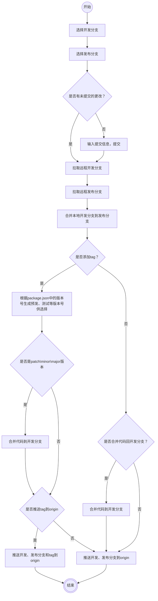

# publish-sh

本地合并代码，构建 tag 并提交脚本。

## 使用

方式一：下载代码，然后在项目内执行`npm link`
方式二：`npm install https://github.com/imzbf/publish-sh.git -g`

卸载方式均为：`npm uninstall publish-sh -g`

### 使用

在需要发布的项目中执行`pb`

流程示意：

